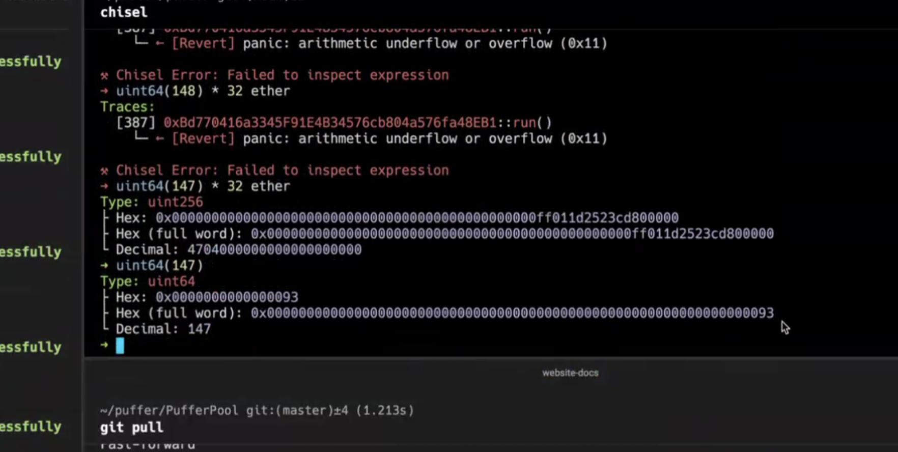

# Oracle Optimization hotfix upgrade

- [Timeline](#timeline)
  - [Friday, May 11, 2024](#friday-may-11-2024)
- [Initial report and investigation](#initial-report-and-investigation)
- [Issue debugged](#issue-debugged)
- [Identifying where the issue was introduced](#identifying-where-the-issue-was-introduced)
- [Fix timeline](#fix-timeline)
  - [Deployments](#deployments)
  - [PR for fixes and the deployment scripts](#pr-for-fixes-and-the-deployment-scripts)
  - [Contracts were deployed](#contracts-were-deployed)
  - [Assign roles](#assign-roles)
- [Finalize the upgrade](#finalize-the-upgrade)
- [Implications](#implications)


# Timeline 
## Friday, May 11, 2024

- 1:02 am - Initial issue was raised as the `totalAssets` was returning 0 on Puffer Vault
    - Impact: totalAssets value is required to calculate the pufETH/ETH conversion ratio ("price"). This issue has resulted in some DeFi integrations being implicitly paused, as the view calls would revert internally
- 1:23 am - War room began to check if pausing the contracts is needed
    - BlockSec and Creed auditors were contacted
- 1:45 am - Verified that all the funds are safe and the latest provisioned validators are using the correct protocol controlled withdrawal addresses.
- 2:25 am - The issue was found to be the overflow in the `PufferOracle.getLockedEthAmount()`, introduced in a storage optimization code change, which now is resulting in the totalAsset call failure
  - after the number of active validators exceeded 147
  - TLdr; `148 * 32 ether > uint64.max`, results in an overflow in the calculations
- 2:35 am - Pausing provisioning the validators on the backend
- 2:55 am - Initial PR for a patch was pushed
    - Internal review and modification
    - Creed and BlockSec code reviews
- 3:30 am - Internal testing using Tenderly forks, for smart contract upgrades, access control checks, and sanity checks on the variables
- 4:25 am - New contracts with the fix were deployed and upgrade simulations began
- 5:30 am - New contracts were verified on etherscan
- 6:10 am - The upgrade transactions were crafted and the community multisig was notified for emergency upgrade
- 7:30 am - Community multisig finalized the upgrade and the transactions were broadcasted
- 8:00 am - Fix is verified to be effective and finalized.
- 9:04 am - Provisioning validators are resumed and all systems go.

---

# Initial report and investigation

May 11, midnight eastern: 

> Why total assets showing 0 https://etherscan.io/address/0xD9A442856C234a39a81a089C06451EBAa4306a72#readProxyContract
> 


```solidity
function totalAssets() public view virtual override returns (uint256) {
    uint256 callValue;
    // solhint-disable-next-line no-inline-assembly
    assembly {
        callValue := callvalue()
    }
    return _ST_ETH.balanceOf(address(this)) + getPendingLidoETHAmount() + getELBackingEthAmount()
        + _WETH.balanceOf(address(this)) + (address(this).balance - callValue) + PUFFER_ORACLE.getLockedEthAmount();
}
```

The error was isolated to be in the `PUFFER_ORACLE.getLockedEthAmount()` function which reverts:

```rust
cast call 0x8eFd1Dc43AD073232F3e2924e22F173879119489 --rpc-url https://eth.llamarpc.com "getLockedEthAmount()(uint256)"
Error:
server returned an error response: 
error code 3: execution reverted: 
panic: arithmetic underflow or overflow (0x11)
```

# Issue debugged



`uint64(148) * 32 ether` overflows the uint64 packing (as well as for any number > 147)

As validators were provisioned at the PufferProtocol, the `PufferOracle.provisionNode()` was called:

```solidity
function provisionNode() external restricted {
    unchecked {
        ++_numberOfActivePufferValidators;
    }
    emit NumberOfActiveValidators(_numberOfActivePufferValidators);
}
```

This increased `_numberOfActivePufferValidators` to `> 147` causing the function `getLockedEthAmount()` to revert. 

```solidity
function getLockedEthAmount() external view returns (uint256) {
    return _numberOfActivePufferValidators * 32 ether;
}
```

The result is that `PufferVault.totalAssets()` reverts.

From BlockSec:

> To summarize, the root cause of the problem is the incorrect data type. Using uint64 as the type leads to overflow.
> 
> 
> The confusion arises from why a value of 147 is the maximum value that doesn't cause an overflow. In other words, when performing the calculation _numberOfActivePufferValidators * 32 ether, it first gets cast to uint72 before being cast to uint256. Please note that _numberOfActivePufferValidators is of type uint64.
> 
> This occurs because 32 ether is greater than 2^64 - 1 and is implicitly treated as uint72. In Solidity, **when multiplying two values, the compiler casts the result to the type with the larger whole number length**. In this case, where _numberOfActivePufferValidators is uint64 and 32 ether is uint72, the result is first cast to uint72. Consequently, an overflow occurs when the value is 148.
> 

---

# Identifying where the issue was introduced

The issue was introduced in the storage optimization commit:

```solidity
     * @dev Number of active Puffer validators
     * Slot 0
     */
    uint64 internal _numberOfActivePufferValidators;

    /**
     * @dev Total number of Validators
     * Slot 0
     */
    uint64 internal _totalNumberOfValidators;
    /**
     * @dev Epoch number of the update
     * Slot 0
     */
    uint64 internal _epochNumber;
```
PR: https://github.com/PufferFinance/PufferPool/pull/231/files

Given that this commit was added after the holesky deployment used for staging, all our tests so far did not encounter such issue on testnet (524 validators on holesky so far). 

---

# Fix timeline

- Stop provisioning new validator - (done at 2:35 AM)
    - Removed the event trigger to stop the cronjob — stopping guardians to provision validator

## Deployments

- new **PufferOracleV2** needs to be deployed, with the fix uint256 for active validators
    - Import the current Oracle variables as constructor variables for the new contract
        - _epochNumber = 268828
        - _totalNumberOfValidators = 927122
        - _numberOfActivePufferValidators = 174 
        - _setMintPrice([3098470956104156](https://etherscan.io/unitconverter?wei=3098470956104156)) (latest value)

The following contracts need to be updated since the `PufferOracleV2` address is an immutable variable set in the constructor:

- new **PufferVaultV2** implementation
    - Only swap the PufferOracleV2 address in the constructor
- new **ValidatorTicket** implementation
    - Only swap the PufferOracleV2 address in the constructor
- new **OperationsCoordinator**
    - Only swap the PufferOracleV2 address in the constructor
- new **PufferProtocol implementation**
    - Only swap the PufferOracleV2 address in the constructor

## PR for fixes and the deployment scripts

- PR: https://github.com/PufferFinance/PufferPool/pull/256/files
- https://github.com/PufferFinance/pufETH/blob/71d7c18450f66d564e0b11d8cac14d3b61feebcf/script/UpgradePufETHOnMainnet.s.sol

## Contracts were deployed

- https://etherscan.io/tx/0xc8ae6854300abb9322c6f8654ba08afd9aaaa888b8a27388a1cad87417351d08
- https://etherscan.io/tx/0xcafeaf90667f8211b87e48f57a9e5370e2add91437f52c83d3ac3b958e28a260
- https://etherscan.io/tx/0xd0a9becb68608edae475394151d21bf091a8193fbe590b71e5bb59372acaa7bd
- https://etherscan.io/tx/0x5a2f4e83e19e6b33fce07710d5acae5199156d0c82168386cb5e25cc29a0f575
- https://etherscan.io/tx/0x370fde4254e711576873adb054bdce8c217cfe7822acef8d353451a0a46f0698
- https://etherscan.io/tx/0x9d4db5af8cb489b899bdf7d699a281a013d730afc2f371fb708dc9ad771bc203
- https://etherscan.io/tx/0x2c485d8b964ca8bb86de04d520befcab5d5ccc24ed99766c234a57decbe2b7b5

## Assign roles

Review and assign the roles for the new contracts based on the [access control list](https://github.com/PufferFinance/Deployments-and-ACL/blob/main/docs/access-control/contracts_and_functions.md):

PR: https://github.com/PufferFinance/PufferPool/pull/256/files#diff-def9abd5a0cdfd2155de31c55c9fb8f6698878c70327d06762d76cd2662e9f9f
Transaction: https://etherscan.io/tx/0x1ab1104144b0b16accce69a0b904f05016d07fe00bdf5d2544a6955f114cb826

---


# Finalize the upgrade

- Send multisig request to finalize the ^ changes.
    - Access Control for the new contracts / function signature
    
    The process:Run `DeployOracleFix` and Update Oracle addressi n `UpgradePufETHOnMainnet` and run the scriptFrom community multisig to generate the call data for multisig:Call to timelock
    
    - executeCall(accessManager, console logged calldata)
    - executeCall(vault) abi-enecoded (upgradeToAndCall(newImpl, “”))
    - executeCall(vt) abi-enecoded (upgradeToAndCall(newImpl, “”))
    - executeCall(protocol) abi-enecoded (upgradeToAndCall(newImpl, “”))

- Community multisig to bypass the 7 day operation delay
- Transaction: https://etherscan.io/tx/0x44d182b89c21811624a2626ac7b9b8d4d1f4ecccd95dedac0cf2dfd828143b53

---

# Implications

- Many DeFI integrations were implicitly paused as the `pufETH/ETH` rate did not return a value
- No assets at risk
    - Provisioned validators were verified that are using the correct Puffer modules as the withdrawal address
    - No change in the asset ratio for the new purchases — purchases were implicitly paused due to divided by 0
- Intentionally pausing the validator provisioning to properly perform the hot fix upgrade